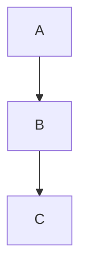

# Markdown Coverage Fixture

Intro paragraph with **bold**, *italic*, `inline code`,
~~strikethrough~~ and a [link](https://example.com/).

## Lists

- Bullet one
- Bullet two
  - Nested bullet

1. Numbered one
2. Numbered two

## Table

| Left | Right |
| ---- | ----- |
| a1   | b1    |
| a2   | b2    |

## Code

```c
int main(void) { return 0; }
```



## Image


## Quote

> A blockquote line.
> Second line.

## Math

Inline $x^2$ and display:

$$\frac{a}{b}$$
