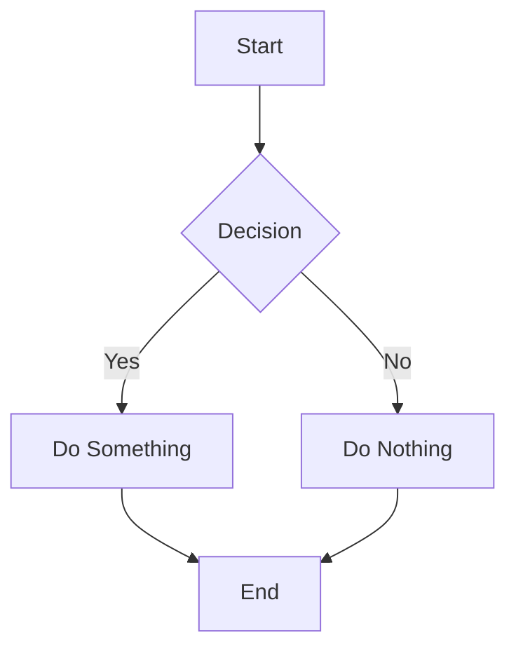
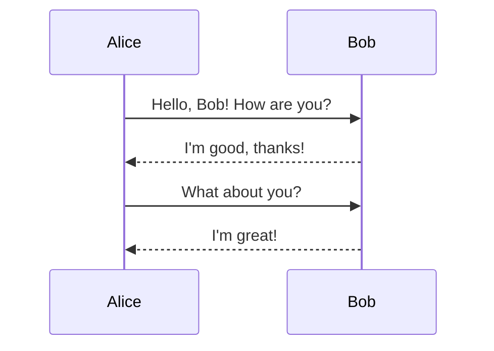
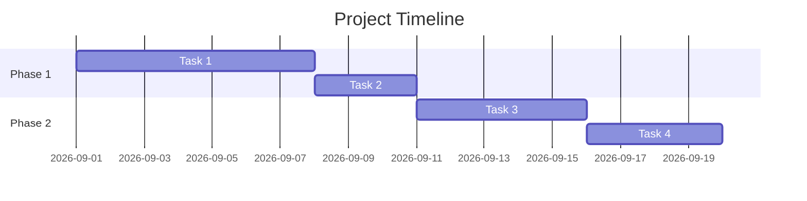
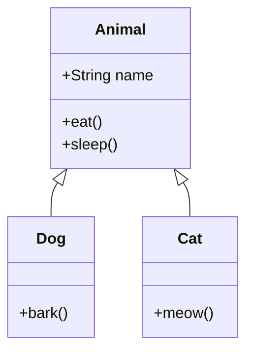
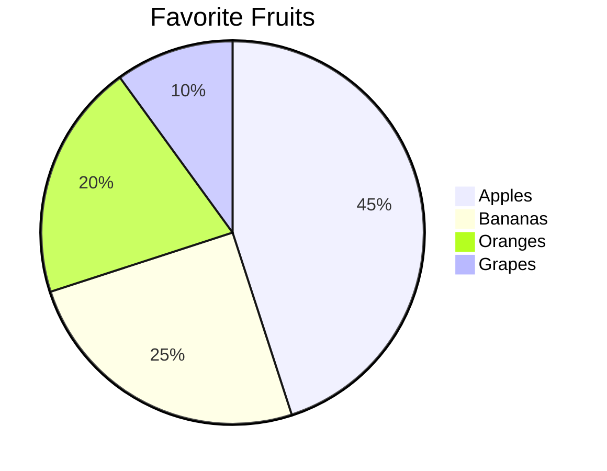

# Extended Zettlr Markdown Formatting Example with Mermaid and KaTeX

This file demonstrates **all formatting options** available in **Zettlr**, including **Mermaid diagrams** and **KaTeX mathematical expressions**. Use this as a reference for creating rich, well-formatted notes, documents, or articles.

---

## Table of Contents
1. [Text Formatting](#text-formatting)
2. [Lists](#lists)
3. [Links and References](#links-and-references)
4. [Images](#images)
5. [Code](#code)
6. [Tables](#tables)
7. [Horizontal Rules](#horizontal-rules)
8. [Footnotes](#footnotes)
9. [Math with KaTeX](#math-with-katex)
10. [Diagrams with Mermaid](#diagrams-with-mermaid)
11. [HTML](#html)
12. [YAML Frontmatter](#yaml-frontmatter)
13. [Comments](#comments)
14. [Escaping Characters](#escaping-characters)
15. [Emoji](#emoji)

---

## Text Formatting

### Headings
Use `#` to create headings. The number of `#` symbols determines the heading level.

# Heading 1
## Heading 2
### Heading 3
#### Heading 4
##### Heading 5
###### Heading 6

---

### Text Styles
- **Bold**: `**Bold**` or `__Bold__` → **Bold**
- *Italic*: `*Italic*` or `_Italic_` → *Italic*
- ~~Strikethrough~~: `~~Strikethrough~~` → ~~Strikethrough~~
- `Inline Code`: `` `Inline Code` `` → `Inline Code`
- **Bold and Italic**: `***Bold and Italic***` → ***Bold and Italic***

---

### Blockquotes
Use `>` to create blockquotes.

> This is a blockquote.
> It can span multiple lines.
>
> > Nested blockquotes are also possible.

---

## Lists

### Unordered Lists
Use `-`, `*`, or `+` to create unordered lists.

- Item 1
- Item 2
  - Sub-item 2.1
  - Sub-item 2.2
- Item 3

### Ordered Lists
Use numbers followed by a `.` to create ordered lists.

1. First item
2. Second item
   1. Sub-item 2.1
   2. Sub-item 2.2
3. Third item

### Task Lists
Use `- [ ]` or `- [x]` to create task lists.

- [ ] Task 1 (uncompleted)
- [x] Task 2 (completed)
- [ ] Task 3 (uncompleted)

---

## Links and References

### Inline Links
- [Google](https://www.google.com)
- [GitHub](https://github.com)

### Reference Links
Define references at the bottom of the document and link to them.

[Zettlr Website][zettlr-link]

[Zettlr Documentation][zettlr-docs]

---

[zettlr-link]: https://www.zettlr.com "Visit Zettlr"
[zettlr-docs]: https://docs.zettlr.com "Zettlr Documentation"

---

## Images

### Inline Images
```markdown

```

Example:


### Reference Images
```markdown
![Alt Text][image-reference]

[image-reference]: image-path "Optional Title"
```

---

## Code

### Inline Code
Use backticks for `inline code`.

### Code Blocks
Use triple backticks (```) for code blocks. Specify the language for syntax highlighting.

#### Python Example
```python
# Python code example
def greet(name):
    print(f"Hello, {name}!")

greet("World")
```

#### Bash Example
```bash
# Bash script example
#!/bin/bash
echo "Hello, World!"
```

#### JavaScript Example
```javascript
// JavaScript example
function greet(name) {
    console.log(`Hello, ${name}!`);
}

greet("World");
```

---

## Tables

Use `|` to create tables. The first row defines the headers, and the second row defines the alignment.

| Syntax      | Description | Example |
|-------------|-------------|---------|
| Header      | Title       | Text    |
| Paragraph   | Text        | More text |
| Footnote    | Note        | Here    |

### Aligned Tables
Use `:` to align columns.

| Left-Aligned | Center-Aligned | Right-Aligned |
|:-------------|:--------------:|--------------:|
| Left         | Center         | Right         |
| Data         | More Data     | Even More     |

---

## Horizontal Rules

Use `---` or `***` to create horizontal rules.

---

***

---

## Footnotes

Use `[^1]` to create footnotes and define them at the bottom of the document.

Here is a sentence with a footnote. [^1]

[^1]: This is the footnote text.

---

## Math with KaTeX

Zettlr supports **KaTeX** for rendering mathematical expressions. KaTeX is a fast, easy-to-use mathematics renderer that works in Markdown.

### Inline Math
Use `$` to create inline math expressions.

Example: The Pythagorean theorem is $a^2 + b^2 = c^2$.

Another example: The area of a circle is $A = \pi r^2$.

### Block Math
Use `$$` to create block math expressions.

#### Example 1: Quadratic Formula
$$x = \frac{-b \pm \sqrt{b^2 - 4ac}}{2a}$$

#### Example 2: Integral
$$\int_{a}^{b} x^2 \,dx$$

#### Example 3: Summation
$$\sum_{i=1}^{n} i = \frac{n(n+1)}{2}$$

#### Example 4: Matrix
$$
\begin{pmatrix}
1 & 2 & 3 \\ 
4 & 5 & 6 \\ 
7 & 8 & 9
\end{pmatrix}
$$ 

#### Example 5: Aligned Equations
$$
\begin{align}
(f + g)(x) &= f(x) + g(x) \\
(f \cdot g)(x) &= f(x) \cdot g(x)
\end{align}
$$

#### Example 6: Greek Letters and Symbols
$$\alpha, \beta, \gamma, \delta, \pi, \sigma, \int, \sum, \prod$$

---

## Diagrams with Mermaid

Zettlr supports **Mermaid** for creating diagrams and visualizations directly in your Markdown files. Mermaid is a simple, intuitive way to create flowcharts, sequence diagrams, Gantt charts, and more.

### Flowchart Example


### Sequence Diagram Example


### Gantt Chart Example


### Class Diagram Example


### Pie Chart Example


---

## HTML

Zettlr supports raw HTML for advanced formatting.

<div style="background-color: #f0f0f0; padding: 10px; border-radius: 5px;">
    <p>This is a custom HTML block with a light gray background.</p>
</div>

---

## YAML Frontmatter

Zettlr supports YAML frontmatter for metadata. This is useful for organizing and managing your notes.

```yaml
---
title: "Extended Zettlr Markdown Formatting Example with Mermaid and KaTeX"
author: "Your Name"
date: 2026-09-21
tags: [markdown, formatting, zettlr, mermaid, katex, example]
---
```

---

## Comments

Use HTML-style comments to add notes that won't appear in the rendered output.

<!-- This is a comment and won't be visible in the rendered markdown. -->

---

## Escaping Characters

Use `\` to escape special characters.

Example: \*This is not italic\* → *This is not italic*

---

## Emoji

Zettlr supports emoji shortcodes.

:smile: :heart: :rocket: :+1: :tada: :bulb: :book: :computer:

---

## Final Notes
This file serves as a **comprehensive reference** for all the formatting options available in **Zettlr**, including **Mermaid diagrams** and **KaTeX mathematical expressions**. Use it to create rich, well-structured, and visually appealing documents.

Happy writing! 🚀